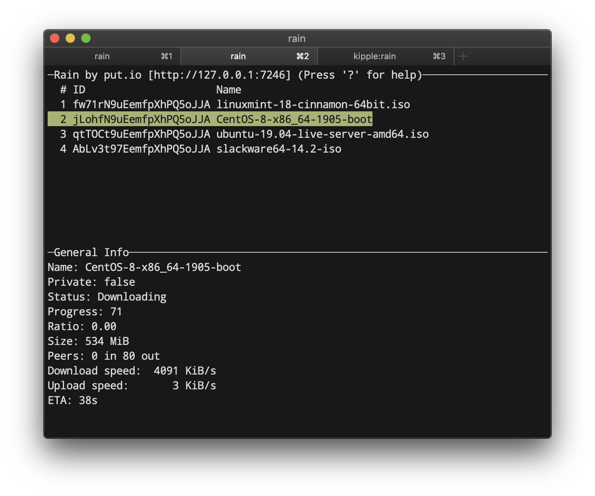

rain
====


---

**High-performance BitTorrent client and library in Go.** Running in production at [put.io][putio-link] since 2019, processing thousands of torrents daily with minimal system resources.

[][docs-link]
[](https://github.com/cenkalti/rain/releases)
[](https://coveralls.io/github/cenkalti/rain)
[](https://goreportcard.com/report/github.com/cenkalti/rain)

Features
--------

### Protocol Support
- [BEP-003: Core protocol](http://bittorrent.org/beps/bep_0003.html)
- [BEP-006: Fast extension](http://bittorrent.org/beps/bep_0006.html)
- [BEP-009: Magnet links](http://bittorrent.org/beps/bep_0009.html)
- [BEP-012: Multiple trackers](http://bittorrent.org/beps/bep_0012.html)
- [BEP-015: UDP trackers](http://bittorrent.org/beps/bep_0015.html)
- [BEP-005: DHT](http://bittorrent.org/beps/bep_0005.html)
- [BEP-011: PEX](http://bittorrent.org/beps/bep_0011.html)
- [BEP-019: WebSeed](http://bittorrent.org/beps/bep_0019.html)
- [Message stream encryption](http://wiki.vuze.com/w/Message_Stream_Encryption)

### Client Features
- Fast resuming with BoltDB persistence
- IP blocklist support
- JSON-RPC 2.0 server & client
- Interactive console UI
- Tools for creating & reading .torrent files
- Resource management (connections, memory, file handles)

Screenshot
----------


Installing
----------

### macOS
```sh
brew install cenkalti/rain/rain
```

### Other Platforms
Download the latest binary from the [releases page](https://github.com/cenkalti/rain/releases).

### From Source
```sh
go install github.com/cenkalti/rain/v2@latest
```

Quick Start
-----------

Rain operates as a client-server application with a single binary.

### 1. Start the Server
```sh
# Start Rain server (using default config)
rain server
```

### 2. Add Your First Torrent
```sh
# Add a magnet link
rain client add "magnet:?xt=urn:btih:..."

# Or add a torrent file
rain client add /path/to/file.torrent

# Or add torrent from URL
rain client add "https://example.com/file.torrent"
```

### 3. Monitor Progress
```sh
# List all torrents
rain client list

# Get stats for a torrent
rain client stats --id <torrent-id>

# Watch progress in console UI
rain client console
```

### 4. Control Downloads
```sh
# Pause a torrent
rain client stop --id <torrent-id>

# Resume a torrent
rain client start --id <torrent-id>

# Remove completed torrent
rain client remove --id <torrent-id>
```

Use `rain help` or `rain help <command>` for detailed information.

Usage as library
----------------

Rain can be embedded in Go applications as a powerful BitTorrent library.

```go
import "github.com/cenkalti/rain/v2/torrent"

// Create session with default config
ses, _ := torrent.NewSession(torrent.DefaultConfig)
defer ses.Close()

// Add a magnet link
magnetLink := "magnet:?xt=urn:btih:..."
tor, _ := ses.AddURI(magnetLink, nil)

// Monitor download progress
for range time.Tick(time.Second) {
	s := tor.Stats()
	log.Printf("Status: %s, Downloaded: %d, Peers: %d", s.Status.String(), s.Bytes.Completed, s.Peers.Total)
}
```

More complete example can be found under `handleDownload` function at [main.go](main.go) file.

See [package documentation][docs-link] for complete API.

Configuration
-------------

Rain works out of the box with sensible defaults, but can be customized with a YAML configuration file.

### Basic Configuration

**Default config location:** `~/rain/config.yaml` (defaults are used if file is missing)

**Custom config:**
```sh
rain server --config /path/to/config.yaml
```

### Complete Reference

For all available configuration options, see [config.go](torrent/config.go).

**Note:** Configuration keys use dash-separated format (e.g., `port-begin`, not `portbegin`) starting from v2.

Architecture
------------

Rain's architecture is designed specifically for high-performance server environments, with several unique characteristics:

### Unique Design Decisions

**Separate Port Per Torrent:** Unlike other BitTorrent clients, Rain allocates a separate peer port for each torrent. This enables:
- Multiple downloads of the same torrent for different accounts on private trackers
- Accurate ratio tracking per account
- Better isolation between torrents

**Server-First Design:** Rain prioritizes server-side performance over desktop features:
- Optimized for hundreds of concurrent torrents
- Minimal system resource usage
- Production-ready stability (running at put.io since 2019)
- JSON-RPC API for remote management

### Project Structure
```
rain/
├── torrent/       # Core BitTorrent session and torrent logic
├── rainrpc/       # Shared types for JSON-RPC 2.0 API
├── internal/      # Internal packages (networking, protocol, storage, etc.)
└── main.go        # Entry point
```

### Component Architecture

Rain follows a layered architecture with clear separation of concerns:

**Core Layer:**
- `torrent/session.go` - Main orchestrator managing torrents, DHT, and shared resources
- `torrent/torrent.go` - Individual torrent lifecycle management

**Protocol Layer:**
- BitTorrent protocol implementation (`internal/peerprotocol/`)
- Tracker communication (`internal/tracker/`, `internal/announcer/`)
- DHT and PEX support (`internal/dht/`, `internal/pex/`)

**Network Layer:**
- Connection management (`internal/peer/`, `internal/peerconn/`)
- Message Stream Encryption (`internal/mse/`)
- Resource limiting (`internal/resourcemanager/`)

**Storage Layer:**
- Piece management (`internal/piece/`, `internal/piececache/`)
- File I/O optimization (`internal/storage/`)
- Resume data persistence with BoltDB

Missing features
----------------

The following features are not implemented in Rain. This list should not be considered a roadmap, as these features are intentionally omitted either because they don't provide sufficient value for our use case at [put.io][putio-link], or because implementing them would add unnecessary complexity to the codebase. We prefer to maintain a focused and efficient implementation that serves our specific needs.

- [BEP-007: IPv6 tracker extension](http://bittorrent.org/beps/bep_0007.html)
- [BEP-032: IPv6 extension for DHT](http://bittorrent.org/beps/bep_0032.html)
- [BEP-029: uTorrent transport protocol](http://bittorrent.org/beps/bep_0029.html)
- [BEP-016: Superseeding](http://bittorrent.org/beps/bep_0016.html)
- [BEP-017: HTTP seeding](http://bittorrent.org/beps/bep_0017.html)
- [BEP-030: Merkle tree torrent extension](http://bittorrent.org/beps/bep_0030.html)
- uPnP port forwarding
- Selective downloading
- Sequential downloading

Contributing
------------

Rain is primarily developed to serve the specific requirements of [put.io][putio-link]. Due to this focused purpose, feature requests that do not align with put.io's needs will likely be rejected. Additionally, we maintain a strong preference for simplicity in implementation. Complex solutions, even if technically superior, will generally not be accepted. Please keep these guidelines in mind when submitting issues or pull requests.

Star History
------------

[](https://star-history.com/#cenkalti/rain&Date)

[putio-link]: https://put.io
[docs-link]: https://pkg.go.dev/github.com/cenkalti/rain/torrent
